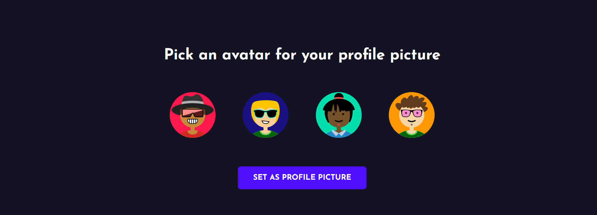

# SNAPPY Chat Application

## Introduction
Welcome to Chatty, a MERN stack-based real-time chat application that provides a seamless chatting experience. With a sleek front-end designed in React.js and a robust Node.js backend, SNAPPY offers a secure and dynamic platform for users to communicate.

## Features
- **User Authentication**: Secure sign-up and login process using JWT for password protection and authorization.

- **Profile Customization**: Users can personalize their profiles by selecting a profile picture.

- **Real-Time Communication**: Built with socket.io to enable live chat between users without any delay.

- **MVC Architecture**: Organized code structure in the public folder following the Model-View-Controller pattern.

## Tools and Technology Used

Chatty is built using a combination of modern and robust technologies that ensure a seamless and real-time chatting experience. Below is a list of the core tools and technologies used in the development of SNAPPY:

- **MongoDB**: A NoSQL database used to store user data and chat messages efficiently.
- **Express.js**: A web application framework for Node.js, designed for building web applications and APIs.
- **React.js**: A JavaScript library for building user interfaces, powering the dynamic and responsive front-end.
- **Node.js**: A JavaScript runtime built on Chrome's V8 JavaScript engine, used for the server-side logic.
- **Socket.io**: Enables real-time, bidirectional, and event-based communication between web clients and servers.
- **JWT (JSON Web Tokens)**: Used for secure user authentication and maintaining session information.
- **Multiavatar API**: An API utilized for generating unique and diverse avatars for user profiles.
- **MVC Architecture**: The Model-View-Controller architectural pattern organizes the code structure and separates concerns within the application.

These technologies work in unison to deliver a high-quality real-time chat application that is both scalable and maintainable.

## Installation
To get started with Chatty, follow these steps:

1. Clone the repository to your local machine.
2. Navigate to the project directory.
3. Install all the necessary dependencies with `npm install`.
4. Change directory to the public folder with `cd public`.
5. Run `npm run starting` to launch both the front-end and back-end servers concurrently.

## Folder Structure

- **public**: Contains the front-end part of the application.
  - **src**: Main source directory.
    - **assets**: Static files like images, fonts, etc.
    - **components**: React components such as `ChatInput.jsx`, `Contacts.jsx`, `Messages.jsx`.
    - **pages**: Page components like `Login.jsx`, `Register.jsx`, `SetAvatar.jsx`.
    - **utils**: Utility files like `APIRoutes.js`.
    - `App.js`: Main application file.
    - `index.js`: Entry point for the React application.

- **server**: Contains the back-end part of the application.
  - **controller**: Holds files responsible for handling input from users.
  - **model**: Contains database schemas or structures.
  - **node_modules**: Directory where all Node.js modules are located.
  - **routes**: Files that define various endpoints and their logic.
  - `.env`: Environment variables file.
  - `index.js`: Main entry point for server-side application.
  - `package-lock.json`: Automatically generated file for any operations where npm modifies either the node_modules tree or package.json.
  - `package.json`: File holding various metadata relevant to the project.

## Usage
Once the installation is complete:
1. Open your web browser.
2. Navigate to `http://localhost:3000` (or your configured port).
3. Register for an account or log in if you already have one.
4. Start chatting with other users in real-time!

## Contributing
Contributions to Chatty are always welcome. Whether it's bug fixes, feature additions, or improvements to the code, feel free to fork the repository and submit a pull request.

